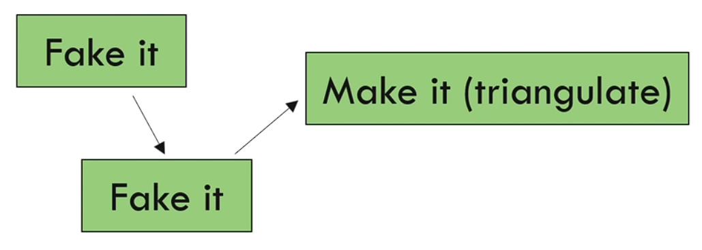

Le Pattern de Triangulation green bar
=====================================

Le pattern de triangulation green bar est un moyen efficace d'arriver rapidement au vert lors de la pratique du TDD. Il consiste à écrire trois tests autour d'un concept pour aboutir à la solution. L'idée est de faire une fausse implémentation (fake it) dans les deux premiers tests pour simplement faire passer le test, même en retournant une valeur codée en dur.

Au troisième test, la triangulation intervient. En créant trois points de données, nous pouvons déterminer l'algorithme ou le modèle à utiliser. Cela permet d'émerger des idées et de trouver la meilleure implémentation. 🚀

Il est souvent possible de trianguler avec seulement trois tests, mais parfois plus de tests sont nécessaires pour voir émerger clairement le modèle. Vous pouvez continuer à faire des fausses implémentations jusqu'à ce que le modèle apparaisse. 🔍

La technique des partitions d'équivalence et des limites que nous avons vue précédemment est un excellent moyen de trouver les valeurs à utiliser pour la triangulation. Il est recommandé de trianguler autour de chaque partition d'équivalence.

Nous mettrons en pratique la triangulation dans la prochaine partie du kata fizzbuzz. Restez à l'écoute ! 👂